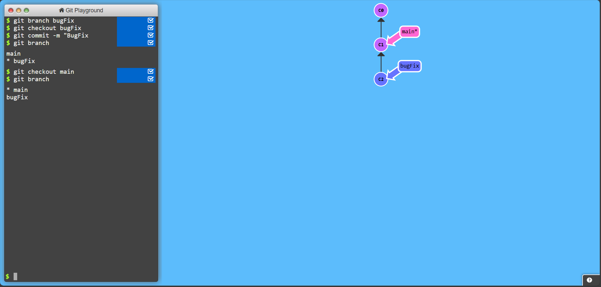
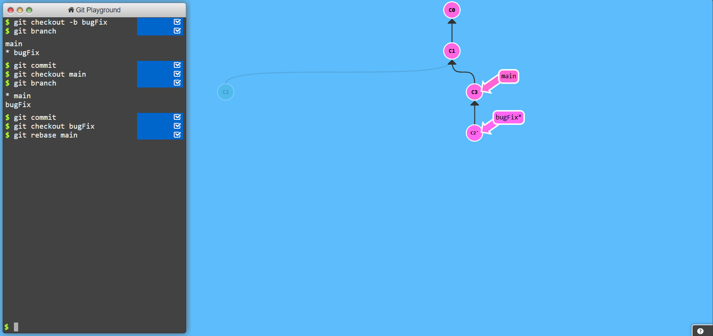

# Git

## Table of Contents

- [1. Git Basics](#1-git-basics)
  
  - [1.1 Introduction to Git Commits](#11-introduction-to-git-commits)
  - [1.2 Branching in Git](#12-branching-in-git)
  - [1.3 Merging in Git](#13-merging-in-git)
  - [1.4 Rebase Introduction](#14-rebase-introduction)

- [2. Advanced Git Operations](#2-advanced-git-operations)

  - [2.1 Detach yo’ HEAD](#21-detach-yo'-head)
  - [2.2 Relative Refs (^)](#22-relative-refs-)
  - [2.3 Relative Refs (~)](#23-relative-refs-)
  - [2.4 Reversing Changes in Git](#24-reversing-changes-in-git)

- [3. Cherry-Picking and Interactive Rebase](#3-cherry-picking-and-interactive-rebase)

  - [3.1 Cherry-pick Intro](#31-cherry-pick-intro)
  - [3.2 Interactive Rebase Intro](#32-interactive-rebase-intro)

- [4. Advanced Commit Manipulation](#4-advanced-commit-manipulation)

  - [4.1 Grabbing Just 1 Commit](#41-grabbing-just-1-commit)
  - [4.2 Juggling Commits](#42-juggling-commits)
  - [4.3 Juggling Commits #2](#43-juggling-commits-2)
  - [4.4 Git Tags](#44-git-tags)
  - [4.5 Git Describe](#45-git-describe)

- [5. Complex Git Operations](#5-complex-git-operations)

  - [5.1 Rebasing over 9000 Times](#51-rebasing-over-9000-times)
  - [5.2 Multiple Parents](#52-multiple-parents)
  - [5.3 Branch Spaghetti](#53-branch-spaghetti)

## Git Basics

### 1.1 Introduction to Git Commits

**Objective:** Initialize a repository and make initial commits to track changes.

1. **Initialize Git Repository**

```bash
git init
```

2. **Create Initial Files and Commit**

```bash
echo "# Project Alpha" > README.md
git add  README.md
git commit  -m  "Initial commit: Add README.md"
```

3. **Make Additional Commits**

```bash
echo "print('Hello, World!')" > main.py
git add  main.py
git commit  -m  "Add main.py with Hello World script"
echo "def add(a, b):" >> main.py
echo " return a + b" >> main.py
git add  main.py
git commit  -m  "Implement add function in main.py"
```

### 1.2 Branching in Git

**Objective:** Create and switch to a new branch for bug fixes.

1. **Create a New Branch**
  
```bash
git branch  bugFix
```


2. **Switch to the `bugFix` Branch**

```bash
git checkout  bugFix
```


3. **Make a Commit on `bugFix`**

```bash
echo " print(add(2, 3))" >> main.py
git add  main.py
git commit  -m  "BugFix: Add print statement for add function"
```


### 1.3 Merging in Git

**Objective:** Merge changes from a feature branch back into the main branch.

1. **Create and Switch to `bugFix` Branch**

```bash
git checkout  -b  bugFix
```


2. **Make a Commit on `bugFix`**

```bash
echo " print(add(2, 3))" >> main.py
git add  main.py
git commit  -m  "BugFix: Add print statement for add function"
```


3. **Switch Back to `main` Branch**

```bash
git checkout  main
```



4. **Make a Commit on `main`**

```bash
echo "def subtract(a, b):" >> main.py
echo " return a - b" >> main.py
git add  main.py
git commit  -m  "Add subtract function in main.py"
```


5. **Merge `bugFix` into `main`**

```bash
git merge  bugFix
```


### **1.4 Rebase Introduction**

**Objective:** Rebase a feature branch onto the latest `main` branch to maintain a linear history.

1. **Create and Switch to `bugFix` Branch**

```bash
git checkout -b bugFix
```


2. **Make a Commit on `bugFix`**

```bash
echo "    print(add(5, 7))" >> main.py
git add main.py
git commit -m "BugFix: Add another print statement for add function"
```


3. **Switch Back to `main` Branch and Make a Commit**

```bash
git checkout main
echo "def multiply(a, b):" >> main.py
echo "    return a * b" >> main.py
git add main.py
git commit -m "Add multiply function in main.py"
```


4. **Switch Back to `bugFix` Branch and Rebase onto `main`**

```bash
git checkout bugFix
git rebase main
```



## 2. Advanced Git Operations

### **2.1 Detach yo’ HEAD**

**Objective:** Check out a specific commit, resulting in a detached HEAD state.

1. **List Commit History**

```bash
git log --online
```

2. **Check Out Commit `C4`**

```bash
git checkout C4
```


### **2.2 Relative Refs (^)**

**Objective:** Use relative references to navigate commit history.

1. **Check Out Parent of Commit `C4`**

```bash
git checkout C4^
```


### **2.3 Relative Refs (~)**

**Objective:** Use `~` to traverse commit history.

1. **Force Move Branches to Specific Commits**

```bash
git branch -f main C6
git branch -f bugFix C0
```


2. **Check Out Commit `C1`**

```bash
git checkout C1
```


### **2.4 Reversing Changes in Git**

**Objective:** Undo changes using `reset` and `revert`.

1. **Reset Local Branch to Previous Commit**

```bash
git reset --hard local~1
```

2. **Check Out Pushed Branch**

```bash
git checkout pushed
```

3. **Revert a Pushed Commit**

```bash
git revert pushed
```

## **3. Cherry-Picking and Interactive Rebase**

### **3.1 Cherry-pick Intro**

**Objective:** Apply specific commits from one branch to another.

1. **Cherry-Pick Commits `C3`, `C4`, and `C7`**

```bash
git cherry-pick C3 C4 C7
```

### **3.2 Interactive Rebase Intro**

**Objective:** Modify commit history interactively.

1. **Start Interactive Rebase**

```bash
git rebase -i main~4 --aboveAll
```

2. **Modify the Rebase Plan**

  - **Remove Commit `C2`**
  - **Move Commit `C5` Up**

## **4. Advanced Commit Manipulation**

### **4.1 Grabbing Just 1 Commit**

**Objective:** Apply a single commit from another branch.

1. **Switch to `main` Branch**

```bash
git checkout main 
```

2. **Cherry-Pick Commit `C4`**

```bash
git cherry-pick C4 
```


### **4.2 Juggling Commits**

**Objective:** Amend commits and manipulate commit history.

1. **Interactive Rebase to Modify Last 2 Commits**

```bash
git rebase -i caption~2 --aboveAll 
```

2. **Amend the Most Recent Commit**

```bash
git commit --amend 
```

3. **Interactive Rebase Again**

```bash
 git rebase -i caption~2 --aboveAll 
```

4. **Force Move `main` Branch to `caption`**

```bash 
git branch -f main caption 
```

### **4.3 Juggling Commits #2**

**Objective:** Further manipulate commit history with cherry-picking and amending.

1. **Switch to `main` Branch**

```bash
git checkout main
```


2. **Cherry-Pick Commit `C2`**

```bash
 git cherry-pick C2
```

3. **Amend the Last Commit**

```bash
 git commit --amend 
```


4. **Cherry-Pick Commit `C3`**

```bash
 git cherry-pick C3 
```

### **4.4 Git Tags**

**Objective:** Tag specific commits for reference.

1. **Create Tags `v0` and `v1`**

```bash
 git tag v0 C1 git tag v1 C2
```

2. **Check Out Tag `v1`**

```bash 
git checkout v1 
```

*Switches to the commit tagged `v1`.*

### **4.5 Git Describe**

**Objective:** Use `git describe` to find a human-readable name for the current commit.

1. **Make a New Commit**

```bash
 echo "print(subtract(5, 2))" >> main.py 
 git add main.py 
 git commit -m "Add print statement for subtract function"
```

2. **Describe the Current Commit**

```bash
git describe 
```

*Outputs a description like `v1-2-gabcdef` indicating 2 commits since `v1`.*

## **5. Complex Git Operations**

### **5.1 Rebasing over 9000 Times**

**Objective:** Perform multiple rebases to simulate complex history manipulation.

1. **Rebase `bugFix` onto `main`**

```bash
 git rebase main bugFix 
```


2. **Rebase `side` onto `bugFix`**

```bash
 git rebase bugFix side 
```

3. **Rebase `another` onto `side`**

```bash
 git rebase side another 
```

4. **Rebase `main` onto `another`**

```bash
 git rebase another main 
```

*This series of rebases creates a deeply intertwined commit history.*

### **5.2 Multiple Parents**

**Objective:** Create branches with multiple parent commits.

1. **Create Branch `bugWork` from a Specific Commit**

```bash
 git branch bugWork main~^2~ 
```

*Creates `bugWork` from a commit two parents back from `main`.*

### **5.3 Branch Spaghetti**

**Objective:** Simulate a tangled branch structure with multiple cherry-picks.

1. **Check Out Branch `one` and Cherry-Pick Commits**

```bash
 git checkout one git cherry-pick C4 C3 C2 
```

2. **Check Out Branch `two` and Cherry-Pick Commits**

```bash
 git checkout two git cherry-pick C5 C4 C3 C2 
```

3. **Force Move Branch `three` to Commit `C2`**

```bash
 git branch -f three C2 
```


